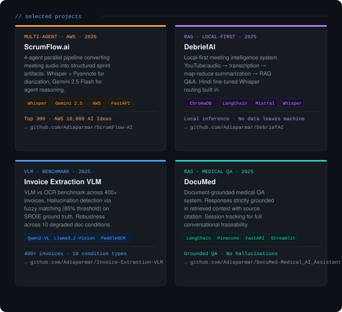

<div align="center">


[](https://www.linkedin.com/in/adiaparmar/)
[](mailto:adiaparmar.dev@gmail.com)

</div>

---

<div align="center">

[](https://github.com/Adiaparmar)

</div>

---

### `// tech stack`

```
Training & Alignment   SFT · DPO · GRPO · LoRA/QLoRA · RAG Pipelines
ML & LLMs              PyTorch · HuggingFace Transformers · LangChain · Ollama
Multimodal & Docs      Vision-Language Models · PaddleOCR · PDF Parsing
Evaluation             ROUGE · METEOR · BERTScore · G-Eval · LLM-as-judge
MLOps & Infra          MLflow · Weights & Biases · Docker · FastAPI · Remote GPU
Databases              PostgreSQL · Pinecone · Neon DB · MongoDB
Languages              Python · C/C++
```

---

<div align="center">
<sub>Open to research collaborations and AI/ML roles · <a href="mailto:adiaparmar.dev@gmail.com">adiaparmar.dev@gmail.com</a></sub>
</div>
